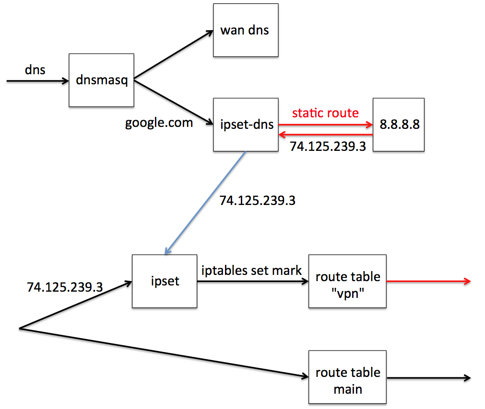

***用 dnsmasq 和 ipset-dns 对指定的域名解析出来的 ip 加到一个 ipset “vpn” 里去。dnsmasq 后来的版本是包含 ipset 功能的，opkg 里包名是 dnsmasq-full，我的路由 rom 只有 4M 装不下，所以还是用 固件自带的 dnsmasq 加 ipset-dns。***

```
$ opkg update
$ opkg install ipset ipset-dns
$ cat /etc/rc.local
ipset -N vpn iphash
exit 0
$ cat /etc/config/ipset-dns
config ipset-dns
# use given ipset for type A (IPv4) responses
option ipset 'vpn'
# use given ipset for type AAAA (IPv6) responses
option ipset6 'vpn6'
# use given listening port
option port '53001'
# use given upstream DNS server,
option dns '8.8.8.8'
$ cat /etc/config/dhcp
config dnsmasq
…
option resolvfile '/tmp/resolv.conf.auto'
list server '/google.com/gstatic.com/googleusercontent.com/googleapis.com/ggpht.com/127.0.0.1#53001'
list server '/twitter.com/facebook.com/youtube.com/127.0.0.1#53001'
# 其他域名会使用 /tmp/resolv.conf.auto 里的 DNS server，是 wan 里配置或者获得的（pppoe）。后面配 vpn 时不要 vpn 的 DNS。
# 如果是 dnsmasq-full，可以直接配置 ipset
# list ipset '/google.com/gstatic.com/ggpht.com/vpn'
```

***用 iproute 增加一个专门的路由表 “vpn”。***

```
$ opkg install ip
$ echo '1 vpn' >> /etc/iproute2/rt_tables
```

***配置vpn，我用的pptp。可以是其他的。***

```
$ cat /etc/config/network
...
config interface vpn
option ifname vpn
option proto pptp
option username XXX
option password XXX
option server XXX
option defaultroute 0 # 主路由表里面不要设置 vpn 线路为默认路由
option peerdns 0 # 保留 pppoe 提供的 DNS，不要 pptp 的。
config route
option interface 'vpn'
option netmask '0.0.0.0'
option table 'vpn' # 在 “vpn” 表里设置 vpn 线路为默认路由
option target '0.0.0.0'
config route
option interface 'vpn'
option target '8.8.8.8' # upstream DNS 通过 vpn 走，防止 DNS 劫持
config rule
option mark '0x1'
option lookup 'vpn' # 对于 mark 0x1 的包，走 vpn 路由表
```

***iptables 配置。***

```
$ cat /etc/config/firewall
config zone
option name wan
list network 'wan'
list network 'wan6'
list network 'vpn' # 这个是 vpn 本身跑通需要的
option input REJECT
option output ACCEPT
option forward REJECT
option masq 1
option mtu_fix 1
config ipset
option external vpn
option match dest_ip
option storage hash
config rule # 对于 ipset “vpn” 里的地址设置 0x1 mark，查询 “vpn” 路由表。
option src lan # 这里貌似不能加 loopback，导致路由器本身发起的流量不能走 vpn。不过无所谓，upstream DNS 8.8.8.8 已经在前面手动加过路由了。
option target MARK
option set_mark 0x1
option family ipv4
option ipset vpn
option proto all
```
